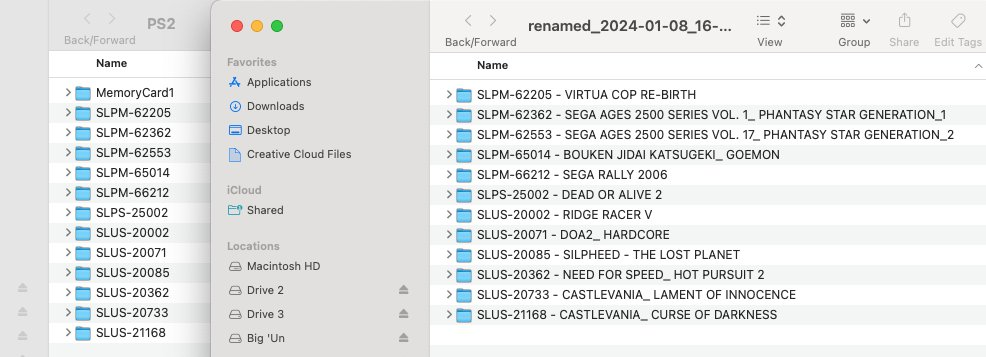

# MemCard PRO Renamer

[**`memcard_pro_renamer.py`**](https://github.com/niemasd/MemCard-PRO-Renamer/releases/latest/download/memcard_pro_renamer.py) is a cross-platform pure-Python script for renaming MemCard PRO save folders.

## Usage
1. Download the [`memcard_pro_renamer.py`](https://github.com/niemasd/MemCard-PRO-Renamer/releases/latest/download/memcard_pro_renamer.py) script to your computer
2. Run the script (e.g. double-click)
3. Drag-and-drop the folder that contains all of your game save folders (or manually type it if drag-and-drop doesn't work on your machine)
4. Hit `ENTER`, and the tool will create a renamed copy of each of your game save folders (to avoid accidentally overwriting and breaking something)

You'll need Python installed on your machine to run this script, and it *should* hopefully work on any operating system out-of-the-box. If not, please feel free to create a [GitHub Issue](https://github.com/niemasd/MemCard-PRO-Renamer/issues) with info about your computer's operating system / environment, and I can try to help figure it out :-)

## How It Works
It'll load the [PSX](https://github.com/niemasd/GameDB-PSX), [PS2](https://github.com/niemasd/GameDB-PS2), and [GameCube](https://github.com/niemasd/GameDB-GC) serial-number-to-title mappings from [my game databases](https://github.com/niemasd/GameDB), and it'll automatically rename your game folders as follows:

* If your game save folders are in the original `SXXX-XXXXX` serial number format, it'll rename them to `SXXX-XXXXX - GAME TITLE` so you can back them up in a human-readable format
* If your game save folders are already in the renamed `SXXX-XXXXX - GAME TITLE` format, it'll rename them back to the `SXXX-XXXXX` serial number format so you can restore them back onto the MemCard PRO
* It should also support GameCube (`DOL-XXXX-XXX` serial number format), but I haven't test it yet myself

Here's an example of before and after (left = original MemCard PRO 2 folder; right = renamed folders; screenshot by [Joe Redifer from Game Sack](https://gamesack.net/)):

## Missing Games
If you find any games that aren't in my databases, please consider submitting their info in a GitHub Issue so I can add them!

* PSX Games: [https://github.com/niemasd/GameDB-PSX/issues](https://github.com/niemasd/GameDB-PSX/issues)
* PS2 Games: [https://github.com/niemasd/GameDB-PS2/issues](https://github.com/niemasd/GameDB-PS2/issues)
* GameCube Games: [https://github.com/niemasd/GameDB-GC/issues](https://github.com/niemasd/GameDB-GC/issues)

# OS-Specific Notes
## Windows
Instead of installing Python from [python.org](https://www.python.org), which doesn't seem to work with double-click out-of-the-box (it seems to just instantly close the command prompt that gets opened), try installing Python through the [Microsoft Store](https://apps.microsoft.com/detail/python-3-11/9NRWMJP3717K).

# Acknowledgements
* Thanks to [8BitMods](https://8bitmods.com/) for the awesome MemCard PRO devices!
* Thanks to [Joe Redifer from Game Sack](https://gamesack.net/) for helping me test the script!
